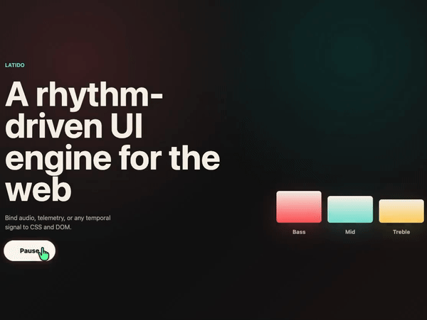

# Latido

> Turn signals into living interfaces.



Make one signal drive multiple render targets in sync.

```txt
audio signal
  → DOM
  → PixiJS
  → Canvas
  → Three.js
```

---

## Quick Start

```js
import { createLatido } from "@latido/core"
import { dom } from "@latido/dom"
import { audio } from "@latido/audio"

const latido = createLatido()
  .use(dom())
  .use(audio({ element: document.querySelector("audio") }))

latido.signal("audio.energy")
  .bindCSSVar(document.body, "--energy")

latido.signal("audio.beat")
  .bindStyle(".button", "transform", v => `scale(${1 + v * 0.1})`)

latido.start()
```

▶️ [Live demo](https://mploscos.github.io/latido/)  
Audio starts after pressing **Play**.

---

## What is Latido?

Latido is a renderer-agnostic rhythm-driven UI engine.

It does not render anything by itself.  
It connects **signals** to **visual behavior**.

Bind any signal to DOM, Canvas, PixiJS, Three.js, or your own renderer.

The adaptive HMI example maps audio, weather, biology, aeronautics, markets, and browser events into the same normalized signals so the interface can change data domains without changing its bindings.

`@latido/core` includes adapter sets for this pattern:

```js
const latido = createLatido().adapt("hmi", {
  initial: "weather",
  adapters: {
    weather: weatherAdapter,
    biology: biologyAdapter
  }
})

latido.signal("hmi.energy").bindCSSVar(document.body, "--energy")
latido.useAdapter("hmi", "biology")
```

---

## Basic Example

```js
import { createLatido } from "@latido/core"
import { dom } from "@latido/dom"
import { audio } from "@latido/audio"

const latido = createLatido()
  .use(dom())
  .use(audio({ element: document.querySelector("audio") }))

latido.signal("audio.energy")
  .smooth(0.15)
  .bindCSSVar(document.body, "--energy")

latido.signal("audio.beat")
  .decay(0.2)
  .bindStyle(".beat-button", "transform", v => `scale(${1 + v * 0.12})`)

latido.start()
```

---

## Targets

Latido works with two kinds of targets:

### DOM (`@latido/dom`)
CSS variables, styles, classes and attributes.

### Objects (`@latido/targets`)
Any renderer with object properties:

- PixiJS  
- Three.js  
- Canvas state  
- Custom engines  

```js
latido.signal("audio.energy")
  .bindTarget(mesh, "scale", v => 1 + v * 0.4)
```

---

## Signal Pipeline

```txt
source → signal → transform → binding → target
```

---

## Run the Demo

```sh
npm install
npm run dev
```

---

## Design Principles

- Latido is not a renderer  
- Latido is not tied to audio  
- Latido is not a framework  
- Latido converts signals into behavior  

---

## Packages

- Core signal pipeline and adapters: `@latido/core`  
- Audio analysis and beat/onset sources: `@latido/audio`  
- DOM bindings: `@latido/dom`  
- Object target bindings: `@latido/targets`  
- Web Animations API bindings: `@latido/waapi`  
- WebSocket and SSE sources: `@latido/network`  
- Browser event sources: `@latido/events`  

`@latido/waapi` and `@latido/network` are included as packages, but the demo gallery does not include dedicated examples for them yet.

## Roadmap

### 0.4.0

- Production examples for network-driven signals  

---

## Audio

Demo audio by Kissan4  
https://pixabay.com/es/users/kissan4-10387284/  

---

## Author

Marcos Pérez  
https://github.com/mploscos
