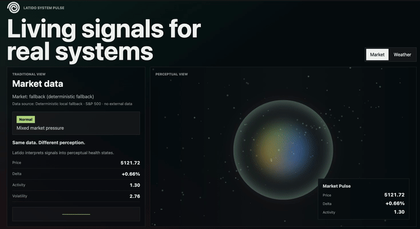

# Latido


> Turn signals into living interfaces.

<p>
  
  
</p>

Make one signal drive multiple render targets in sync.

```txt
audio signal
  → DOM
  → PixiJS
  → Canvas
  → Three.js
```

---

## Quick Start

```js
import { createLatido } from "@latido/core"
import { dom } from "@latido/dom"
import { audio } from "@latido/audio"

const latido = createLatido()
  .use(dom())
  .use(audio({ element: document.querySelector("audio") }))

latido.signal("audio.energy")
  .bindCSSVar(document.body, "--energy")

latido.signal("audio.beat")
  .bindStyle(".button", "transform", v => `scale(${1 + v * 0.1})`)

latido.start()
```

▶️ [Live demo gallery](https://mploscos.github.io/latido/)  
▶️ [System Pulse live example](https://mploscos.github.io/latido/system-pulse/)  
Audio starts after pressing **Play**.

---

## What is Latido?

Latido is a renderer-agnostic rhythm-driven UI engine.

It does not render anything by itself.  
It connects **signals** to **visual behavior**.

Bind any signal to DOM, Canvas, PixiJS, Three.js, or your own renderer.

The adaptive HMI example maps audio, weather, biology, aeronautics, markets, and browser events into the same normalized signals so the interface can change data domains without changing its bindings.

The System Pulse example turns real-world data into behavior - not charts. Weather Pulse uses live Open-Meteo data with no API key, while Market Pulse tries experimental no-key market data and falls back safely when unavailable.

System Pulse is published as a standalone live example for sharing and evaluation: https://mploscos.github.io/latido/system-pulse/

`@latido/core` includes adapter sets for this pattern:

```js
const latido = createLatido().adapt("hmi", {
  initial: "weather",
  adapters: {
    weather: weatherAdapter,
    biology: biologyAdapter
  }
})

latido.signal("hmi.energy").bindCSSVar(document.body, "--energy")
latido.useAdapter("hmi", "biology")
```

---

## Basic Example

```js
import { createLatido } from "@latido/core"
import { dom } from "@latido/dom"
import { audio } from "@latido/audio"

const latido = createLatido()
  .use(dom())
  .use(audio({ element: document.querySelector("audio") }))

latido.signal("audio.energy")
  .smooth(0.15)
  .bindCSSVar(document.body, "--energy")

latido.signal("audio.beat")
  .decay(0.2)
  .bindStyle(".beat-button", "transform", v => `scale(${1 + v * 0.12})`)

latido.start()
```

---

## Targets

Latido works with two kinds of targets:

### DOM (`@latido/dom`)
CSS variables, styles, classes and attributes.

### Objects (`@latido/targets`)
Any renderer with object properties:

- PixiJS  
- Three.js  
- Canvas state  
- Custom engines  

```js
latido.signal("audio.energy")
  .bindTarget(mesh, "scale", v => 1 + v * 0.4)
```

---

## Signal Pipeline

```txt
source → signal → transform → binding → target
```

---

## Run the Demo

```sh
npm install
npm run dev
```

Run the production-style System Pulse example:

```sh
npm --workspace examples/system-pulse run dev
```

It works without API keys or a backend. If external data is unavailable, the example keeps running with deterministic local fallback data.

Production links:

- Demo gallery: https://mploscos.github.io/latido/
- System Pulse: https://mploscos.github.io/latido/system-pulse/

---

## Design Principles

- Latido is not a renderer  
- Latido is not tied to audio  
- Latido is not a framework  
- Latido converts signals into behavior  

---

## Packages

- Core signal pipeline and adapters: `@latido/core`  
- Audio analysis and beat/onset sources: `@latido/audio`  
- DOM bindings: `@latido/dom`  
- Object target bindings: `@latido/targets`  
- Web Animations API bindings: `@latido/waapi`  
- WebSocket and SSE sources: `@latido/network`  
- Browser event sources: `@latido/events`  

`@latido/waapi` is included as a package, but the demo gallery does not include a dedicated example for it yet.

## Version 0.4.0

- Production-style System Pulse example for network-driven signals
- Live Open-Meteo weather source with deterministic fallback
- Experimental no-key market source with deterministic fallback
- Interpreted perceptual health states over raw signals

---

## Audio

Demo audio by Kissan4  
https://pixabay.com/es/users/kissan4-10387284/  

---

## Author

Marcos Pérez  
https://github.com/mploscos
