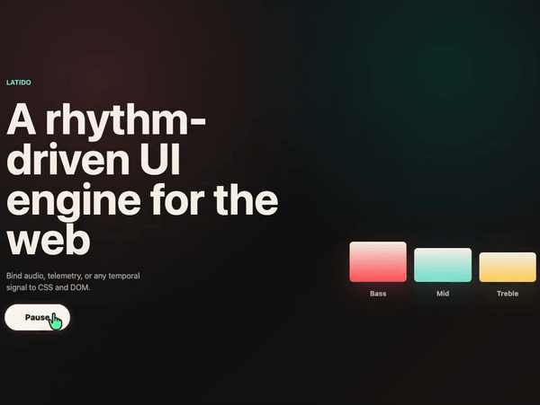
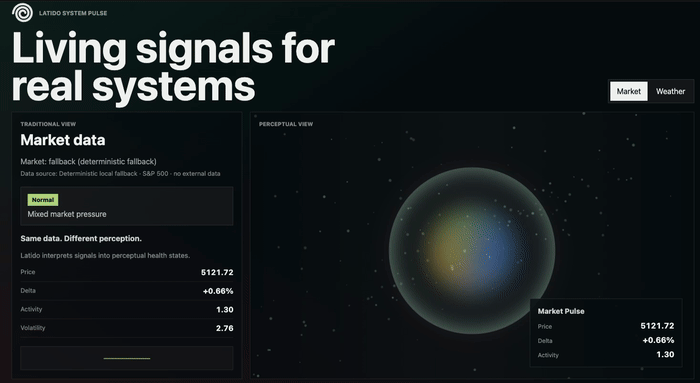

# Latido


> Latido turns signals into perceptual interfaces.

<p>
  
  
</p>

Latido is a signal engine for living interfaces.

```txt
source → signal → interpretation → behavior → target
```

It is not a renderer, not a framework and not only audio. Use it to connect real-time values to DOM, Canvas, PixiJS, Three.js, Web Animations API or your own rendering layer.

## Install

```sh
npm install @latido/web
```

Use individual packages when you need fine-grained control:

```sh
npm install @latido/core @latido/dom @latido/audio
```

## Quick Start

```js
import { createLatido, dom, audio, signals } from "@latido/web"

const latido = createLatido()
  .use(dom())
  .use(audio({ element: audioEl }))

latido.signal(signals.audio.energy)
  .bindCSSVar(document.body, "--energy")

latido.start()
```

## Links

- [Documentation](https://mploscos.github.io/latido/)

## Packages

- `@latido/web`: common browser entrypoint
- `@latido/core`: scheduler, sources, signals and transforms
- `@latido/dom`: CSS variables, styles, classes and attributes
- `@latido/audio`: Web Audio sources and beat/onset analysis
- `@latido/targets`: renderer-agnostic object bindings
- `@latido/network`: WebSocket and SSE sources
- `@latido/events`: browser event sources
- `@latido/waapi`: Web Animations API bindings

## Run Locally

```sh
npm install
npm run dev
```

Run the docs site:

```sh
npm --workspace examples/docs run dev
```

Run System Pulse:

```sh
npm --workspace examples/system-pulse run dev
```

## Version 0.5.0

- New Vite documentation site focused on onboarding and adoption
- New `@latido/web` browser entrypoint
- System Pulse weather source now interprets Open-Meteo conditions, gusts, rain, showers and snowfall
- Concise README pointing to live docs and examples
- Documentation for concepts, packages, examples, recipes, API and roadmap

## Author

Marcos Pérez  
https://github.com/mploscos
